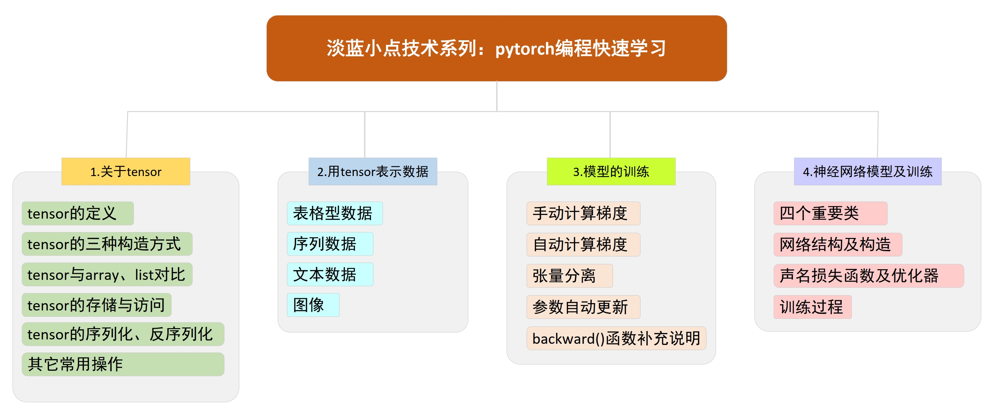

<h1> 淡蓝小点技术系列：pytorch编程快速学习 </h1>

## 项目介绍
pytorch是由美国Meta公司开发发布的深度学习训练框架，在学术界和工业界都广受欢迎。
《pytorch编程快速学习》是由淡蓝小点发布的一项快速介绍pytorch编程原理及方法的技术专题，它对有一定机器学习（深度学习）理论基础、python编程经验，
但对pytorch编程还不太了解、不太熟悉的朋友可能会有一些帮助。

本专题最主要目的在于让参与者能快速上手pytorch编程，构造并训练自定义模型或神经网络。
为了节省大家的宝贵时间，此专题中不包含有关python编程和机器学习的基础性内容介绍，
直接介绍如何使用pytorch读取数据、设计模型并训练。虽然课程简短，但具有短、平、快、精的特点，节奏紧凑、重点突出、信息密度较满。
适用的典型人群包括高年级本科生、低年级研究生（硕士博士）等。

如下图所示，专题内容主要分成四个部分：
1.	关于tensor
2.	用tensor表示数据
3.	模型的训练
4.	神经网络模型及训练

在任何一份介绍pytorch的资料中，都一定会首先介绍tensor，tensor是pytorch中最基础最重要的数据结构，
它贯穿整个pytorch编程；了解了有关tensor的常用操作后，
将示范如何用tensor表示各类数据，包括表格型数据、序列数据、文本和图像；整个专题最重要的是第三部分，
为了让大家能清晰的了解机器学习模型的训练原理，会一步步构建一个简单的线性模型并手动计算其梯度，实现对它的训练。
模型虽小，但管中窥豹可见一般。
然而手动计算不是我们的目标，因此接紧着会介绍如何利用pytorch实现梯度自动计算、参数自动更新。
第四部分是利用前三部分知识，示范构建一个具有分类能力的神经网络，是对整个专题内容的综合应用。

此专题不会深入介绍pytorch的更多高级特性，也不像以往的专题
（如PRML Page-by-page或《学习理论精炼介绍》、《DDPM原理推导入代码实现》）有较强的理论性，
技术门槛较低、内容较简洁，专门适用经验不足者轻装上阵、快速突袭。

更多内容请见B站：https://space.bilibili.com/353555504
最后，谢谢大家！

## 谁是淡蓝小点
淡蓝小点是PRML Page-by-page项目的发起人，这是一个旨在帮助机器学习从业人员读懂PRML每一页的项目，
它包括约80小时的视频和一本1000页的note，可通过下面链接找到相关视频。若想要note请加微信索取。

PRML Page-by-page：https://space.bilibili.com/353555504?spm_id_from=333.1007.0.0

微信号及二维码：bluedotdot_cn

